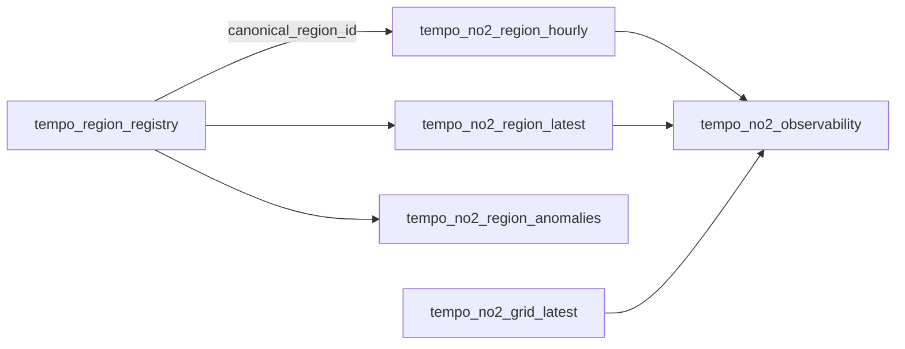

# Analysts

Use this hub when you want to query TitanSkies data, not operate it.
TitanSkies ships software and local warehouse tooling, not a hosted dataset or
health advice.

## Do You Already Have A Warehouse?

=== "Yes — open and query"

    Open the DuckDB file from `make demo` or your configured `DUCKDB_PATH`:

    ```bash
    duckdb titanskies.duckdb
    ```

    Prefer `duckdb.connect(..., read_only=True)` in notebooks so you do not
    compete with a writer. Continue with
    [Query the warehouse](../guides/query-the-warehouse.md).

=== "No — need a run first"

    Ask an operator to complete [Quickstart](../getting-started/index.md) or
    [Run the pipeline](../guides/run-the-pipeline.md), then return here.

## Join Map



Practical join rules:

- Prefer `canonical_region_id` for administrative marts.
- Filter measurements with `is_analysis_ready` for analysis.
- The standard scope mirrors these shapes under `tempo_no2_std_*`.

## Next Pages

| Goal | Page |
| --- | --- |
| Shortest query path | [Query the warehouse](../guides/query-the-warehouse.md) |
| Copy-paste SQL | [Query recipes](../guides/query-recipes.md) |
| Grain and mistakes | [Data dictionary](../reference/data-dictionary.md) |
| Formal contracts | [Data contracts](../reference/data-contracts.md) |
| TEMPO product facts | [TEMPO product notes](../concepts/tempo-product-notes.md) |
