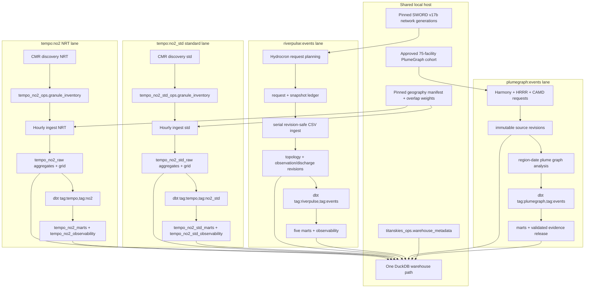

# Architecture

Stack: Dagster, earthaccess/Harmony, requests, xarray/Zarr, PyArrow, DuckDB,
dbt.

TitanSkies runs **two independent TEMPO NO2 scopes, RiverPulse, and
PlumeGraph** in one local warehouse:
`tempo:no2` (NRT) and `tempo:no2_std` (standard V04). Each scope has its own
CMR concept ID, raw directory, ops ledger, hour-revision sequence, quality
contract CSV, Dagster jobs/schedule flag, and published mart/observability
schemas. They share pinned geography artifacts when both registries are
materialized, but they never share raw epochs or incremental contract
versions.
The explicit `riverpulse:events` and `plumegraph:events` lanes share only the
DuckDB path and v0.7 schema stamp; neither uses the TEMPO `ScopeSpec` factory.
The two reproduction preflight profiles are likewise explicit, unscheduled
assets and share only validation/persistence code for their common metadata
invariants.

## Per-granule ingest path

Within a scope, CMR discovery upserts immutable granule identities into that
scope's ops ledger. When CMR `revision-date` advances for a previously
processed granule, discovery requeues it (pending statuses, cleared
checksum/path, stale NetCDF removed under the scope raw directory) so ingest
can replace the region-hour aggregates; download-URL-only refreshes do not
requeue. Hourly ingestion downloads each pending or failed granule, validates
the NetCDF layout, computes weighted regional statistics, and writes
idempotent regional aggregates. The latest supported native-grid cells,
regional aggregates, and processed-ledger success commit in one transaction
per granule; failure rolls all three back before its error is recorded
separately. A failed batch finishes the remaining work, records every error,
then fails the Dagster asset.

Failed files are deleted so the next run downloads a clean copy. Successful
retries clear the prior error. This favors correctness over bandwidth; the
ledger remains the source for attempt status and recovery details.

NetCDF files remain under the configured raw data directory for that scope.
Before ingestion, files for successfully processed granules older than the
scope retention window are deleted, and only their `local_path` is cleared.
Checksums, sizes, timestamps, raw aggregates, and processed ledger history
remain in DuckDB.

## Contracts and publication

Each scope has a sole quality contract CSV. Python reads accepted quality
flags before aggregation, while dbt reads the same row for coverage,
freshness, and anomaly policy. Environment variables configure operations, not
competing quality thresholds. Freshness is observability-only;
`is_analysis_ready` does not encode stale age. `*_region_latest` pre-filters
analysis-ready non-country regions and does not expose `is_analysis_ready`.

Production overlap weights stay as sorted, compressed Parquet and are loaded
once as columnar arrays for an ingestion batch. DuckDB stores a small artifact
manifest rather than duplicating the weights. Administrative marts retain
hourly history; the public native-grid mart intentionally retains only the
latest cell observation.

`make demo` exercises the NRT lane only. Standard marts appear after an
explicit standard discovery/ingest and dbt run.
`make riverpulse-demo` separately exercises synthetic network registration,
request/snapshot persistence, multiple revisions, discharge normalization,
and RiverPulse-only dbt publication.
`make plumegraph-demo` separately exercises an invented 75-facility cohort,
source revisions, plume analysis, abstaining calibration, dbt publication,
and checksum verification of an immutable local evidence release.

## Per-request RiverPulse path

The SWORD build verifies the pinned archive, selects at most 100 connected
mainstem reaches per pilot, and atomically publishes immutable reach/edge
Parquet generations. Hydrocron discovery creates deterministic reach ×
half-open-window requests. The collector runs serially, retries transient
responses, and treats only the documented no-data 400 as successful.

For each successful body it writes a checksum-addressed snapshot, parses all
rows, then transactionally appends snapshot metadata, observation/discharge
revisions, provenance links, and request success. Successful siblings survive
a partial batch; any failure keeps publication blocked. Current revision
selection happens in dbt and cannot be reversed by an older rediscovery.

## Per-partition PlumeGraph path

An approved frozen cohort produces immutable overlapping 100 km analysis
regions. Discovery plans deterministic region/month Harmony and HRRR requests
plus CAMD hours. Ingestion retains source snapshots and append-only pixel,
meteorology, and CEMS revisions. Snapshot registration, date-partitioned
normalized Parquet registration, normalized DuckDB rows, and request success
commit in one transaction. Source lineage records Harmony job/results, HRRR
source-path manifests, and CAMD endpoint/page state without credentials or
signed URLs.

Region × UTC-date analysis uses a three-hour overlap, commits successful
siblings, and promotes only complete generations. Its identity includes both
contract and algorithm versions. The scan graph retains every qualifying
many-to-many edge; episode revision identity includes the graph edge, source
candidate, and pixel identities. dbt publishes the current episode view plus
historical detail evidence for every retained revision. Validation controls
whether probabilities are enabled and whether an immutable release may be
built.

See [Orchestration](../reference/orchestration.md) and
[TEMPO product notes](tempo-product-notes.md), plus
[RiverPulse product notes](riverpulse-product-notes.md) and
[PlumeGraph product notes](plumegraph-product-notes.md).
