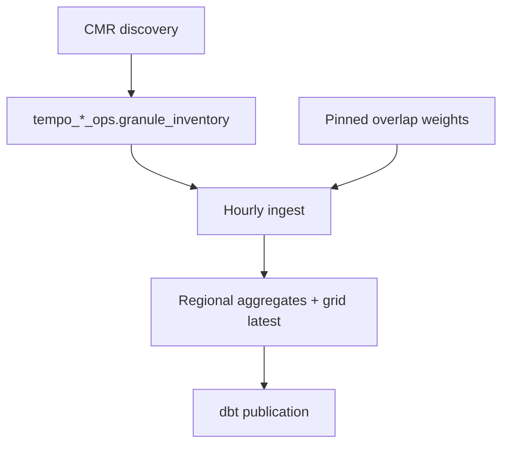

# Architecture

Stack: Dagster, earthaccess, xarray, DuckDB, dbt.

CMR discovery upserts immutable granule identities into the scope ops ledger.
Hourly ingestion downloads each pending or failed granule, validates the
NetCDF layout, computes weighted regional statistics, and writes idempotent
regional aggregates. The latest supported native-grid cells, regional
aggregates, and processed-ledger success commit in one transaction per
granule; failure rolls all three back before its error is recorded separately.
A failed batch finishes the remaining work, records every error, then fails
the Dagster asset.

Failed files are deleted so the next run downloads a clean copy. Successful
retries clear the prior error. This favors correctness over bandwidth; the
ledger remains the source for attempt status and recovery details.

NetCDF files remain under the configured raw data directory. Before ingestion,
files for successfully processed granules older than the retention window are
deleted, and only their `local_path` is cleared. Checksums, sizes, timestamps,
raw aggregates, and processed ledger history remain in DuckDB.

Each scope has a sole quality contract CSV. Python reads accepted quality
flags before aggregation, while dbt reads the same row for coverage,
freshness, and anomaly policy. Environment variables configure operations, not
competing quality thresholds.

Production overlap weights stay as sorted, compressed Parquet and are loaded
once as columnar arrays for an ingestion batch. DuckDB stores a small artifact
manifest rather than duplicating the weights. Administrative marts retain
hourly history; the public native-grid mart intentionally retains only the
latest cell observation.

See [Orchestration](../reference/orchestration.md) and
[TEMPO product notes](tempo-product-notes.md).
