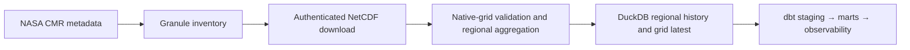

# System overview

TitanSkies converts NASA TEMPO L3 NO₂ granules into regional hourly DuckDB
marts and native-grid latest observations for Canada, the United States, and
Mexico. Version `0.5.x` also collects revision-safe NASA SWOT RiverSP reach
observations and discharge estimates for bounded Sacramento, Rhine, and Murray
mainstem corridors. Version `0.6.x` adds `plumegraph:events`: a frozen 2024,
75-facility TEMPO L2/HRRR/CAMD plume-evidence benchmark and immutable local
release format. All four lanes share one local warehouse.

Dagster owns execution and lineage. DuckDB owns durable local state. NetCDF
files remain operator-owned local artifacts and are pruned only after their
granules were processed successfully. dbt publishes regional, national,
latest, anomaly, data-quality, and public native-grid latest relations per
scope.

RiverPulse follows a parallel explicit path: a verified SWORD v17b archive
produces immutable reach/topology generations; Hydrocron discovery plans
deterministic reach/time requests; serial ingestion retains response snapshots
and every observation/discharge revision; dbt publishes the current revision,
complete revision history, and request/scientific-quality observability. It
does not add RiverPulse to the TEMPO scope factory.

PlumeGraph follows another explicit path: Harmony subsets pinned TEMPO L2 V04,
the public HRRR archive provides analysis winds, and EPA CAMD provides
local-standard-time hourly NOx. Region-date analysis retains every revision,
promotes complete generations atomically, publishes calibrated probabilities
only when held-out validation passes, and produces checksum-verified evidence
releases. Attribution remains a scientific hypothesis rather than proof.

See [Architecture](architecture.md),
[Choose a scope](../getting-started/choose-a-scope.md), and
[Scope and non-goals](scope-and-non-goals.md).
