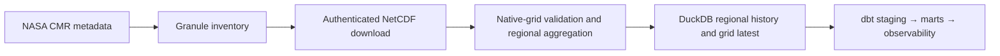

# System overview

TitanSkies converts NASA TEMPO L3 NO₂ granules into regional hourly DuckDB
marts and native-grid latest observations for Canada, the United States, and
Mexico. Version `0.4.x` ships two parallel scopes: `tempo:no2` (NRT) and
`tempo:no2_std` (standard V04).

Dagster owns execution and lineage. DuckDB owns durable local state. NetCDF
files remain operator-owned local artifacts and are pruned only after their
granules were processed successfully. dbt publishes regional, national,
latest, anomaly, data-quality, and public native-grid latest relations per
scope.

See [Architecture](architecture.md),
[Choose a scope](../getting-started/choose-a-scope.md), and
[Scope and non-goals](scope-and-non-goals.md).
